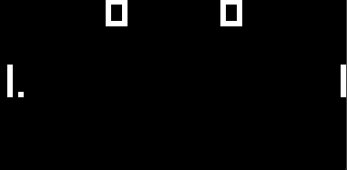
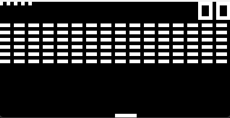
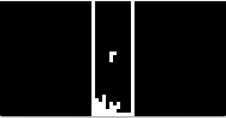

<h1 align="center"><b>CHIP 8 EMULATOR</b></h1>
<div align="center">
  <a href="https://golang.org/dl" target="_blank">
    
  </a>
  <a href="./LICENSE" target="./LICENSE">
    
  </a>
    <p></p>A Chip8 emulator written in Golang, using the SDL library with Go SDL for the graphical interface.</p>
</div>

## **Intoduction**

Chip-8 is an interpreted programming language, developed by Joseph Weisbecker. It was initially used on the COSMAC VIP and Telmac 1800 8-bit microcomputers.

The Chip8 platform featured a 4KB memory and was designed to create simple games and applications. While Chip8 programs were originally intended for microcomputers, enthusiasts later developed emulators to run these vintage programs on modern systems (like me).

## **The project 📢**

The project is to practice a discover the world of emulation and the SDL library, so my first approach was to create a Chip8 emulator with Go and Go-SDL2 bindings

The primary goal is to provide a stable and feature-rich emulator that can faithfully recreate the behavior of original Chip8 systems.

SDL provide a graphical user interface and handle user input.

### Features ✨
- Accurate Chip8 emulation (all opcodes)
- Graphical display rendering (64x32 for the orignal chip8) scaled
- Audio playback (if applicable to the ROM)
- Keyboard input handling (check Key Bindings)
- Save and load state functionality (if applicable in future updates)

### Screenshoots 📷

- Pong :



- Brix :



- Tetris :




## **Requirements 📍**

### Language 📙

This project is written in the Go programming language (Golang). Go is known for its simplicity, efficiency, and excellent concurrency support, making it a great choice for developing high-performance applications and emulators like this Chip8 project.

Download : https://go.dev/doc/install

### Libraries 📚

#### 1. SDL2 (Go-SDL2)

**Go-SDL2** a library that wrap SDL2 for Go.
SDL is multimedia development library designed to provide low-level access to audio, keyboard, mouse, joystick, and graphics hardware via OpenGL and DirectX

```
go get github.com/veandco/go-sdl2/sdl
```

Note: SDL2 library is written in C. That means that you need the original SDL2 installated. Read the installation instructions for sdl2 library from [`go-sdl2`](github.com/veandco/go-sdl2) for your os.

## **How to use the emulator ❓**

### Launch the program ▶️

#### 1. Download the project:

Clone this repository to your local machine:

```bash
git clone https://github.com/la-ref/go-chip8-emulator
cd go-chip8-emulator
```
OR

Get code :
```
go get -u github.com/la-ref/go-chip8-emulator
```

2   . Load a Chip8 ROM:

Edit the `main.go` file and replace the ROM path with your path or roms that are available in the rom folder.
Check [Customizable Options](#customizable-options)

3   . Build and run the emulator:
```
go run main.go
```

### Key Bindings 🎲

```
    Chip8           Keyboard (AZERTY)       Keyboard (QWERTY)
1 | 2 | 3 | C        1 | 2 | 3 | 4           1 | 2 | 3 | 4
- - - - - - -        - - - - - - -           - - - - - - -
4 | 5 | 6 | D        A | Z | E | R           Q | W | E | R
- - - - - - -        - - - - - - -           - - - - - - -
7 | 8 | 9 | E        Q | S | D | F           A | S | D | F
- - - - - - -        - - - - - - -           - - - - - - -
A | 0 | B | F        W | X | C | V           Z | X | C | V

ESC : EXIT
SPACE : PAUSE
BACKSPACE : RESET
```
The default keyboard mapping is assigned to AZERTY

## Customizable Options

The following options are available for customization in the `main.go` file:

- `VERSION`: Represents the version type of the Chip8 emulator. (CHIP8,SUPERCHIP,XOCHIP)

- `WIN_TITLE`: Sets the window title for the emulator's graphical user interface.

- `SCALE_FACTOR`: Controls the scale at which each pixel is displayed in the emulator.

- `FG_COLOR` and `BG_COLOR`: Define the foreground and background colors of the emulator's display.

- `TARGET_FPS`: Sets the target frame rate for the emulator's rendering loop.

- `CLOCK_RATE`: Specifies the number of Chip8 instruction cycles executed per second.

- `VOLUME`: Adjusts the volume level for the sound playback. (0-100)

- `SQUARE_WAVE_FREQ` and `SAMPLE_RATE`: Control the frequency and sample rate of the emulator's sound.

- `KEYBOARD`: Specifies the keyboard layout to be used in the emulator. The default is "AZERTY" but you can change it to "QWERTY".

- `ROM`: Path of the current loaded rom

To customize any of these options, simply open the `main.go` file in your favorite text editor and modify the values to suit your preferences.
After making changes, save the file and rebuild the emulator to apply the new settings.

## **Sources**

- [Guide to making a CHIP-8 emulator](https://tobiasvl.github.io/blog/write-a-chip-8-emulator/)
- [Chip-8 opcode table](https://en.wikipedia.org/wiki/CHIP-8)

## **Support Me**
Give me a ⭐ if this project was helpful in any way!

## **Licence**
This project is licensed under the MIT License. You are free to use, modify, and distribute this code following the terms of the license
